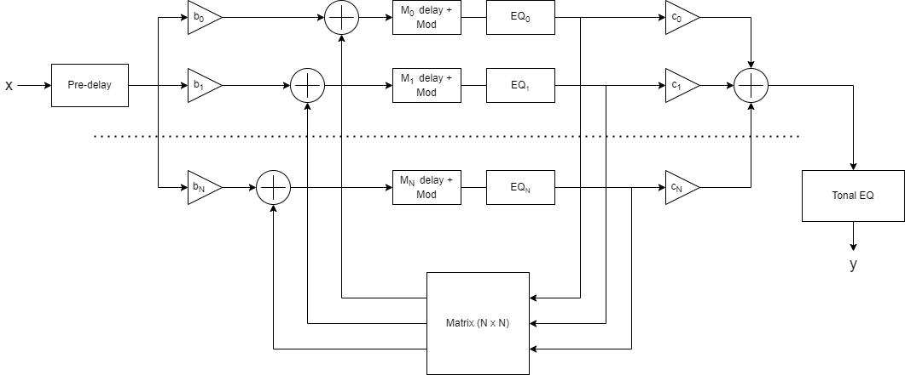

# Feedback Delay Network Reverberator implementation in JUCE

## The plugin

Following FDN architecture has been implemented as a VST3 plugin in JUCE

The plugin is configured for 16 delay lines with graphic equalizers, pre-delay, and modulating delay-lines.

With scrollable UI:

---
## Compiling the plugin
The plugin is created with JUCE version 6.1.2. 
To create build configurations run the Projucer.

Current configurations exist for VisualStudio 2019 and LinuxMakefile.
